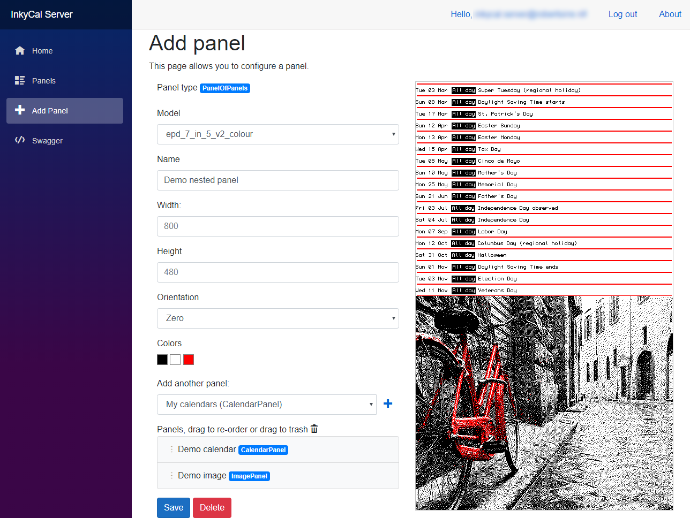
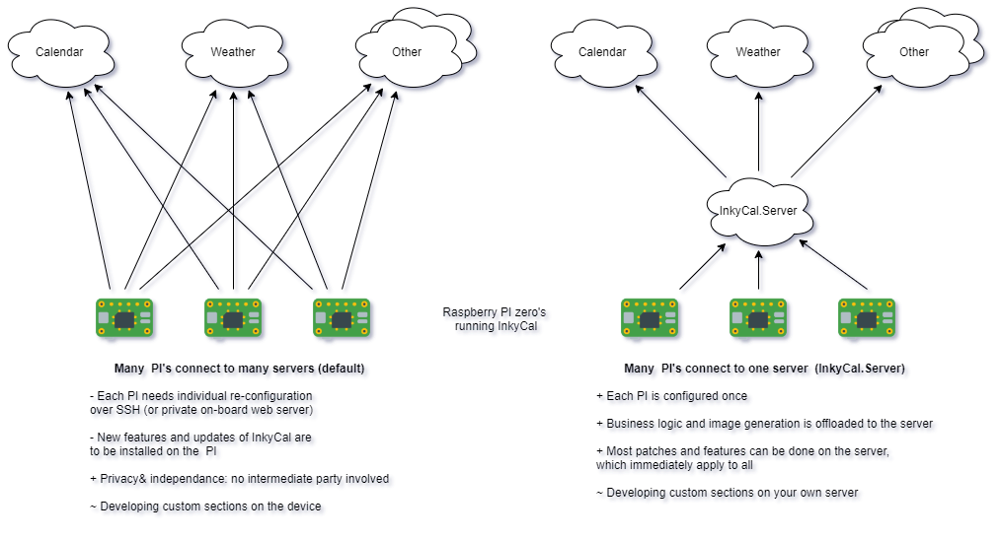

[](https://github.com/Atrejoe/Inky-Calendar-Server/actions/workflows/build-and-test.yml)

# Inky-Calendar Server

An easy-to-configure, web-based image generator to supply E-Ink compatible panels to [Inky-Calendar](https://github.com/aceisace/Inky-Calendar) (or any other E-ink display).

To enjoy this as a service, see: [inkycal.robertsirre.nl](https://inkycal.robertsirre.nl/) *(domain name subject to change)*



[toc]

## Why use Inky-Calender *server* at all?

As an owner of an Inky-Calendar powered e-ink panel you want to set up your panel once, and then forget about it. New features and bugfixes should come easy and for all  panels at once.



> Note:  some features may still require an update on the PI,  think of pending features like: on-board webserver for configuration (instead of SSH) , managing panel refresh-types (maybe push-updates will supported)

This service about:

- reducing the hassle of updates
- increasing panel-quality (centralized bug reporting)
- speeding  up development of features
- offloading costly operations away from a low-power PI zero. Maybe even lower-power, battery-operated devices will be supported.

## Why would I run this myself?

There are a few good reasons to want to run this small server by yourself:

1. You want to contribute! Nice, you can develop your own panel implementations or squash a bug!
2. You do not want to share your details with yet another third party.
3. You want to learn .Net Core and Blazor

## How to run

### Option 1: With .Net Core

*Recommended for development*

Clone this repository, then in the root:

```bash
dotnet run --project InkyCal.Server

#or even better, auto-restart upon code changes:
dotnet watch --project InkyCal.Server run
```

#### Configuration

##### Database

Some operations (like storing preferences) require a database, SQL server. You can install one on your machine, run one in a docker-container or it a network and then adjust the connection string in `appsettings.json` > `ConnectionStrings` > `DefaultConnection`

##### Pdf processing : install Ghostscript

In order to convert Pdfs to images you need to have [Ghostscript](https://www.ghostscript.com/) installed.
In the prebuilt Docker images this is already taken care of. When running it yourself (like during development), you need to install it.

### Option 2: With Docker

*Recommended for quick tests without a database*

On Docker using an image from [Dockerhub](https://hub.docker.com/r/atreyu/inkycal.server) it's easy to start the web-application:

```
docker run -p 80:80 atreyu/inkycal.server:latest
```
The server will be available at: [http://localhost](http://localhost). The application needs a database for some sections. To configure a database connection to your database use:

```
docker run ^
 -env ConnectionStrings__DefaultConnection=Server=MyServerName;Database=MyDataBaseName;User=MyUserName;Password=MyPassword;MultipleActiveResultSets=true ^
 -p 80:80 ^
 atreyu/inkycal.server:latest
```

### Option 3: With docker-compose 🚀

*Recommended for permanent or frequent use*

Create a file named [`docker-compose.yml`](https://docs.docker.com/compose), containing your server setup: the web application and a database:

```dockerfile
version: '3'
services:
  web:
    image: "atreyu/inkycal.server:latest"
    ports:
      - 5100:5000
    environment:
      - ASPNETCORE_ENVIRONMENT=Development
      - ASPNETCORE_URLS=http://0.0.0.0:5000/
      - ConnectionStrings__DefaultConnection=Server=db;Database=InkyCal.Server;User=sa;Password=${DB_SA_PASSWORD};MultipleActiveResultSets=true
    depends_on:
      - db
    restart: always
  db:
    image: "mcr.microsoft.com/mssql/server"
    environment:
       SA_PASSWORD: "${DB_SA_PASSWORD}"
       ACCEPT_EULA: "Y"
       MSSQL_PID: "Express"
    #Expose port for development purpose only
    # ports:
    #  - 1433:1433
    volumes:
      # Mapped volume for permanent storage of credentials and panel config
      - ./sqlserver:/var/opt/mssql/data
    restart: always
```

Then create an environment file named [`.env`](https://docs.docker.com/compose/env-file/) for storing secrets and re-usable variables:

```dockerfile
DB_SA_PASSWORD=MySAP@ssw0rd!
```

Then fire up your container:

```bash
docker-compose up -d
```

The server will be available at: [http://localhost:5100](http://localhost:5100).

>  When hosting yourself, you may not want to expose this directly to the internet, but use a reverse proxy, like NGinx and configure ssl.

# Host prerequisites

## Pdf rendering
Some components (New York Time panel) use a Pdf converter. This requires Ghostscript to be installed on the host.

### Windows
Download & install [Ghostscript](https://ghostscript.com/), or install using Chocolatey:

```
choco install ghostscript
```

### Linux
```
RUN apk add ghostscript
```